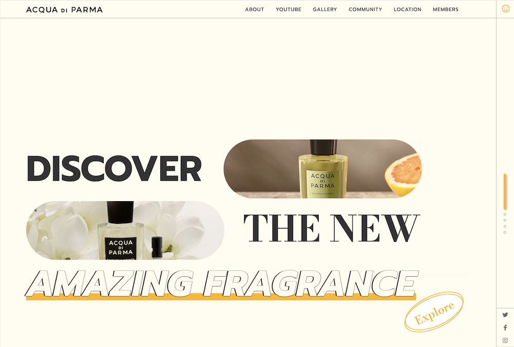

# 리액트 기업형 웹사이트

React JS로 제작한 개인 포트폴리오용 기업형 웹사이트입니다.

## Table of contents

- [Overview](#overview)
  - [Features](#features)
  - [Screenshot](#screenshot)
  - [Links](#links)
- [My process](#my-process)
  - [Built with](#built-with)
  - [What I learned](#what-i-learned)
  - [Reference](#reference)
- [Author](#author)

## Overview

### Features

- Main, About, Youtube, Gallery, Community, Location, Members 페이지로 구성된 기업형 웹사이트
- Web, Tablet, Mobile 크기별 반응형 웹사이트 구현
- Redux를 활용하여 데이터 상태 관리 및 Redux-saga를 활용하여 비동기 처리
- Youtube API, Kakao map API, Flickr API 등 다양한 API 사용
- Local Storage를 이용하여 CRUD 게시판 구현

### Screenshot

### Links

- Live Site URL: [https://yjkim0109.github.io/react_p](https://yjkim0109.github.io/react_p)

## My process

### Built with

- [React](https://reactjs.org/) - JS library
- SCSS

### What I learned

- React 기본 활용
- Redux & Redux-saga
- 세로 스크롤 이벤트

### Reference

- [Acqua di parma](https://www.acquadiparma.com/)

## Author

- Github - [김예지 Yeji Kim](https://github.com/yjkim0109)
